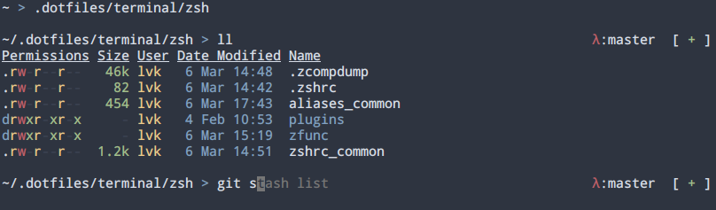

# Terminal/tools configuration

Somewhat portable zsh configuration. This configuration will also source $HOME/.zshrc if it exists.



## Features

- fzf plugin
  - `<Ctrl-t>` to search/insert file on the command line
  - `<Ctrl-r>` to search history
  - `<Alt-c>` to search and cd
  - Entering `** <TAB>` in the terminal will launch fzf to autocomplete the current prompt
  - See [fzf: Key bindings for command-line](https://github.com/junegunn/fzf?tab=readme-ov-file#key-bindings-for-command-line) and [fzf: Fuzzy completion for bash and zsh](https://github.com/junegunn/fzf?tab=readme-ov-file#fuzzy-completion-for-bash-and-zsh) for details and extra configuration
- bd plugin
  - Use bd to go back to any directory in your cwd
- tmux config and alternate aliases, mostly lifted from https://thevaluable.dev/tmux-config-mouseless/
  - `<Ctrl-Space>` as default prefix
  - `<Ctrl-Space> h` and `<C-space v>` for horizontal/vertical splits
  - `<Ctrl-Space> s/j` to split/join panes
  - `<Ctrl-hjkl>` to switch panes
  - `<Ctrl-Space> arrow-keys` to resize panes
- In aliases_common:
  - `l` (list files), `la` (list all files), `ll` (list long files)
  - `d` to see recent directory stack history, `0-9` to go to one of the stacked directories
  - Ranger (alias `ra`) and config to use `fzf` when `<Ctrl-t>` is pressed
  - `rgp` to ripgrep long output and use `bat` to page it

## Credits

- Most of the implementation and configs are based on or copied from Phantas0s' [github](https://github.com/phantas0s) and [blog](https://thevaluable.dev). I've mostly just adapted it to my personal needs and I'm putting it up here so I can clone it to other machines. Maybe it'll be useful to you, too.
- zfunc/purification is modified from https://github.com/Phantas0s/purification to use ripgrep and consolidate some calls
- The tmux config is adapted from https://github.com/Phantas0s/.dotfiles/blob/master/tmux/tmux.conf

## Requirements, recommendations

The following requirements are mandatory:

- [Font Awesome 4](https://fontawesome.com/v4.7.0/) (for purification's git status symbols) 
- [git](https://git-scm.com)
- [ripgrep](https://github.com/BurntSushi/ripgrep) (intuitive, fast grep replacement, used for the git status line)
- [fzf](https://github.com/junegunn/fzf) 0.48.0+ (fuzzy matcher)

The following packages are optional, but used/included in aliases_common:

- [exa](https://github.com/ogham/exa) (directory listing)
- [bat](https://github.com/sharkdp/bat) (cat replacement)
- [duf](https://github.com/muesli/duf) (df replacement)
- [ranger](https://github.com/ranger/ranger) (vim-like file browser)

Other cool projects for making terminal life easier:

- [k9s](https://k9scli.io/) (if you do anything with k8s)
- [delta](https://github.com/dandavison/delta) (nice diff viewer)

## Installation

- Install at least the mandatory requirements
- Check out this repository somewhere and copy the folders to $XDG_CONFIG_HOME (or use gnu stow)
- Create ~/.zshenv which includes at least

```bash
export TERM="xterm-256color"
export XDG_CONFIG_HOME="$HOME/.config"
export ZDOTDIR="$XDG_CONFIG_HOME/zsh"
```

- Run plugins/install.sh which checks out two plugins for fzf and bd

### Optional steps

- If you want to use the the common aliases, `source "$ZDOTDIR/aliases_common"` in your own ~/.zshrc
- If you don't like some aliases, you can `unalias $ALIAS` in your own .zshrc
- If you want a history file, set HISTFILE and related zsh variables. I'm personally using:


```bash
HISTFILE=$HOME/.zsh_history
HISTSIZE=10000
SAVEHIST=999999999
```

- If you want to use ranger, run `ranger --copy-config rifle` to create a default config for yourself
- If you're using vim in tmux, <C-hjkl> to switch panes may not work without something like https://github.com/christoomey/vim-tmux-navigator
- If you're looking for a neovim config, consider [NvChad](https://nvchad.com/), it has pretty nice defaults

## License

[MIT](http://opensource.org/licenses/MIT)
